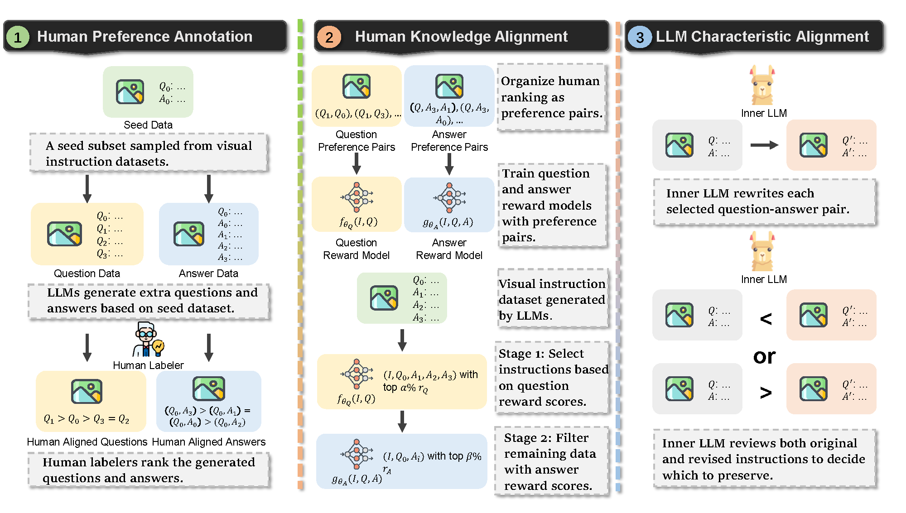

<h1 align="center"> Align<sup>2</sup>LLaVA: Cascaded Human and Large Language Model Preference Alignment for Multi-modal Instruction Curation </h1>

<div align="center">
Hongzhe Huang<sup>1</sup>, Jiang Liu<sup>1</sup>, Zhewen Yu<sup>1</sup>, Li Cai<sup>1</sup>, Dian Jiao<sup>1</sup>, Wenqiao Zhang<sup>1&dagger;</sup>, Siliang Tang<sup>1</sup>,

Juncheng Li<sup>1</sup>, Hao Jiang<sup>2</sup>, Haoyuan Li<sup>2</sup>, Yueting Zhuang<sup>1</sup>

<sup>1</sup>Zhejiang University, <sup>2</sup>Alibaba

<sup>&dagger;</sup>Corresponding Authors

<a href='https://arxiv.org/abs/2409.18541'></a>

</div>

## Overview

Align<sup>2</sup>LLaVA is a novel instruction curation algorithm, derived from two unique perspectives,  **human and LLM preference alignment**, to compress the vast corpus of machine-generated multimodal instructions to a compact and high-quality form.



In this repository, we provide implementation for our proposed reward models in the human knowledge alignment, and LLaVA-1.5 instruction tuning.

## Intallation

1. Clone this repository and enter the root directory.
   
   ```
   git clone https://github.com/DCDmllm/Align2LLaVA.git
   cd Align2LLaVA
   ```
2. Clone the [LLaVA](https://github.com/haotian-liu/LLaVA) repository, and install the environment for LLaVA-1.5 instruction tuning.

   ```
   git clone https://github.com/haotian-liu/LLaVA.git
   cd LLaVA
   conda create -n llava python=3.10 -y
   conda activate llava
   pip install --upgrade pip  # enable PEP 660 support
   pip install -e .
   ```
3. Install additional packages for training cases.

   ```
   pip install -e ".[train]"
   pip install flash-attn --no-build-isolation
   ```
4. Clone the LLaVA-1.5 environment to prepare a new one for reward model.

   ```
   conda create -n align2llava_rm --clone llava
   conda activate align2llava_rm
   pip uninstall llava  # reward models and LLaVA-1.5 use different code base
   ```

## Reward Model

The implementation of our reward model is in the `reward_model` directory. See [reward model](reward_model/README.md) for details.

## Dataset

Our aligned instruction dataset for fine-tuning LLaVA is provided in our [HuggingFace Repo](https://huggingface.co/datasets/Huanghz/Align2LLaVA-IT).

## LLaVA-1.5 Instruction Tuning

We directly fine-tune LLaVA-1.5 on our aligned instructions without any changes to the official code base. To start training, specify the data path and run the script:

```
cd LLaVA
bash ./scripts/v1_5/finetune_lora.sh
```

To evaluate the fine-tuned model, see the [official evaluation document](https://github.com/haotian-liu/LLaVA/blob/main/docs/Evaluation.md) for details.

## Referencing and Citing

If you find this work useful, please consider giving this repository a star and citing our paper as follows:

```
@misc{huang2024align2llavacascadedhumanlarge,
      title={Align$^2$LLaVA: Cascaded Human and Large Language Model Preference Alignment for Multi-modal Instruction Curation}, 
      author={Hongzhe Huang and Jiang Liu and Zhewen Yu and Li Cai and Dian Jiao and Wenqiao Zhang and Siliang Tang and Juncheng Li and Hao Jiang and Haoyuan Li and Yueting Zhuang},
      year={2024},
      eprint={2409.18541},
      archivePrefix={arXiv},
      primaryClass={cs.AI},
      url={https://arxiv.org/abs/2409.18541}, 
}
```

# Acknowledgment
Our project is developed based on the following repositories:

- [LLaVA](https://github.com/haotian-liu/LLaVA): Large Language and Vision Assistant
- [CogVLM](https://github.com/THUDM/CogVLM): Visual Expert for Pretrained Language Models