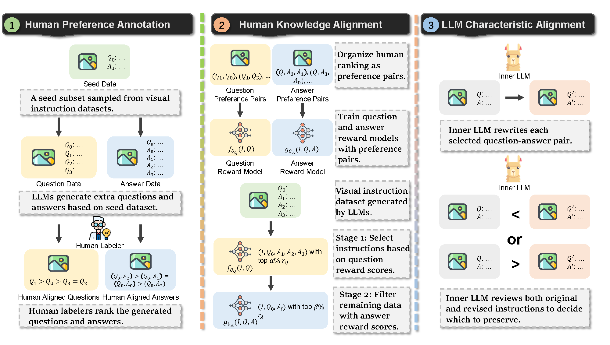

<h1 align="center"> Align<sup>2</sup>LLaVA: Cascaded Human and Large Language Model Preference Alignment for Multi-modal Instruction Curation </h1>

<div align="center">
Hongzhe Huang<sup>1</sup>, Zhewen Yu<sup>1</sup>, Jiang Liu<sup>1</sup>, Li Cai<sup>1</sup>, Dian Jiao<sup>1</sup>, Wenqiao Zhang<sup>1&dagger;</sup>, Siliang Tang<sup>1</sup>,

Juncheng Li<sup>1</sup>, Hao Jiang<sup>2</sup>, Haoyuan Li<sup>2</sup>, Yueting Zhuang<sup>1</sup>

<sup>1</sup>Zhejiang University, <sup>2</sup>Alibaba

<sup>&dagger;</sup>Corresponding Authors

<a href='https://arxiv.org/abs/2409.18541'></a>

</div>

## Overview

Align<sup>2</sup>LLaVA is a novel instruction curation algorithm, derived from two unique perspectives,  **human and LLM preference alignment**, to compress the vast corpus of machine-generated multimodal instructions to a compact and high-quality form.



Code will be available soon.

## Referencing and Citing

If you find this work useful, please consider giving this repository a star and citing our paper as follows:

```
@misc{huang2024align2llavacascadedhumanlarge,
      title={Align$^2$LLaVA: Cascaded Human and Large Language Model Preference Alignment for Multi-modal Instruction Curation}, 
      author={Hongzhe Huang and Zhewen Yu and Jiang Liu and Li Cai and Dian Jiao and Wenqiao Zhang and Siliang Tang and Juncheng Li and Hao Jiang and Haoyuan Li and Yueting Zhuang},
      year={2024},
      eprint={2409.18541},
      archivePrefix={arXiv},
      primaryClass={cs.AI},
      url={https://arxiv.org/abs/2409.18541}, 
}
```